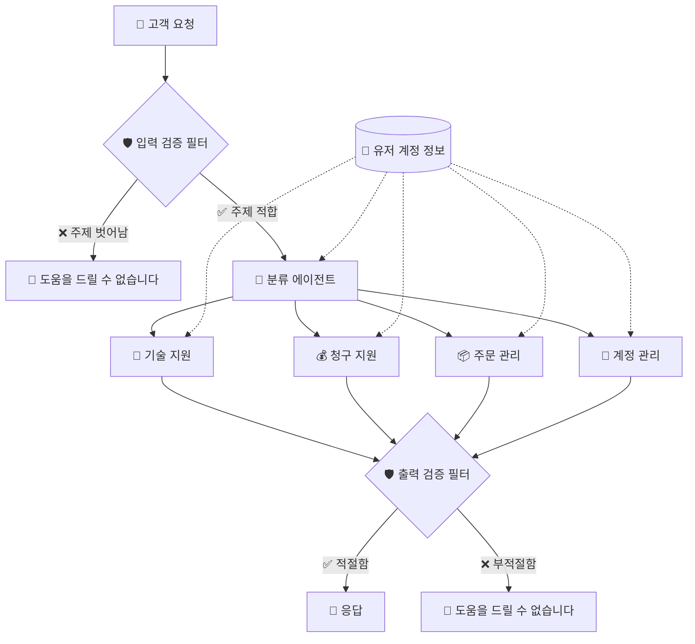

# Customer Support AI Agent

고객 문의 유형에 따라 적합한 AI Agent로 라우팅하는 시스템 실습 프로젝트

## 개요

이 프로젝트는 고객 지원 시나리오에서 AI Agent를 활용하는 방법을 학습하기 위한 실습용 프로젝트입니다.

## 시스템 아키텍처



### 플로우 설명

1. **고객 요청**: 고객이 지원 요청을 시작합니다
2. **입력 검증 필터**: 요청이 지원 범위 내인지 확인합니다
   - 주제에서 벗어난 요청은 거절됩니다
3. **분류 에이전트**: 적합한 요청을 적절한 전문 에이전트로 라우팅합니다
   - 유저 계정 정보를 참조하여 맥락을 파악합니다
4. **전문 에이전트**: 4가지 전문 분야로 처리합니다
   - 🔧 기술 지원: 기술적 문제 해결
   - 💰 청구 지원: 결제 및 청구 관련 문의
   - 📦 주문 관리: 주문 조회 및 처리
   - 👤 계정 관리: 계정 설정 및 관리
5. **출력 검증 필터**: 응답의 적절성을 검증합니다
6. **응답**: 검증된 응답을 고객에게 전달합니다

### 주요 기능 (예정)
- 고객 문의 분류
- 목적에 맞는 전문 Agent로 라우팅
- 대화 컨텍스트 유지

## 시작하기

### 사전 요구사항
- Python 3.11+
- [uv](https://github.com/astral-sh/uv) 패키지 매니저

### 설치

```bash
# 의존성 설치
uv sync

# 환경변수 설정
cp .env.example .env
# .env 파일에 OPENAI_API_KEY 설정
```

### 실행

```bash
uv run python main.py
```

## 기술 스택

- **Python**: 메인 언어
- **uv**: 패키지 관리
- **OpenAI SDK**: LLM API 연동

## 라이선스

이 프로젝트는 학습 목적으로 제작되었습니다.
