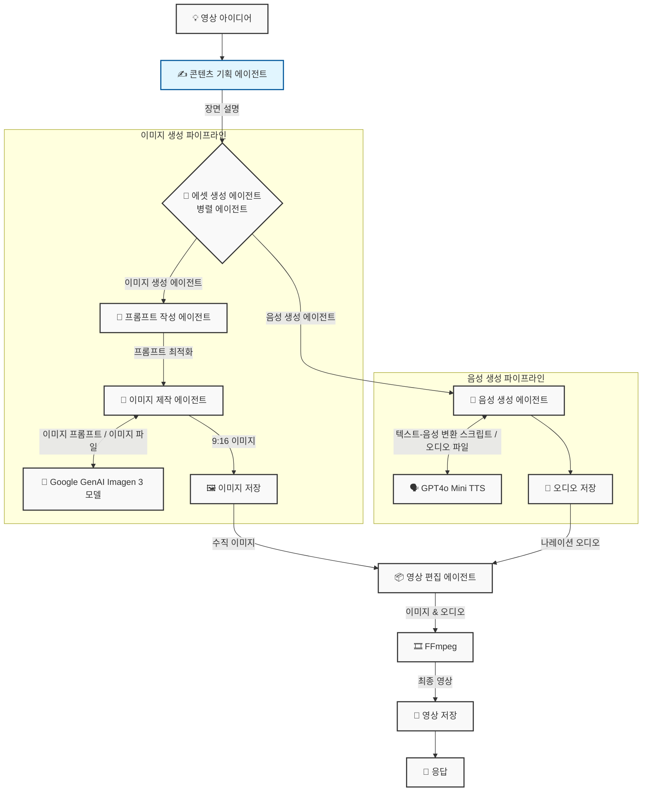

# YouTube Shorts Maker Agent

Google ADK(Agent Development Kit)를 활용하여 YouTube Shorts 콘텐츠를 기획하고 제작하는 AI 에이전트 프로젝트입니다.

## 🏗️ 아키텍처 다이어그램

## 🚀 주요 기능
- **YouTube Shorts 콘텐츠 기획**: 사용자의 아이디어를 바탕으로 스크립트 및 구성안 생성
- **멀티 에이전트 워크플로우**: 기획, 이미지 생성, 음성 생성, 영상 편집 에이전트가 협업
- **자동화된 영상 제작**: FFmpeg를 활용한 영상 합성 및 렌더링

## 🛠️ 기술 스택
- **Language**: Python 3.13
- **Framework**: google-adk
- **Model**: Gemini 2.0 (google-genai)
- **Tools**: FFmpeg
